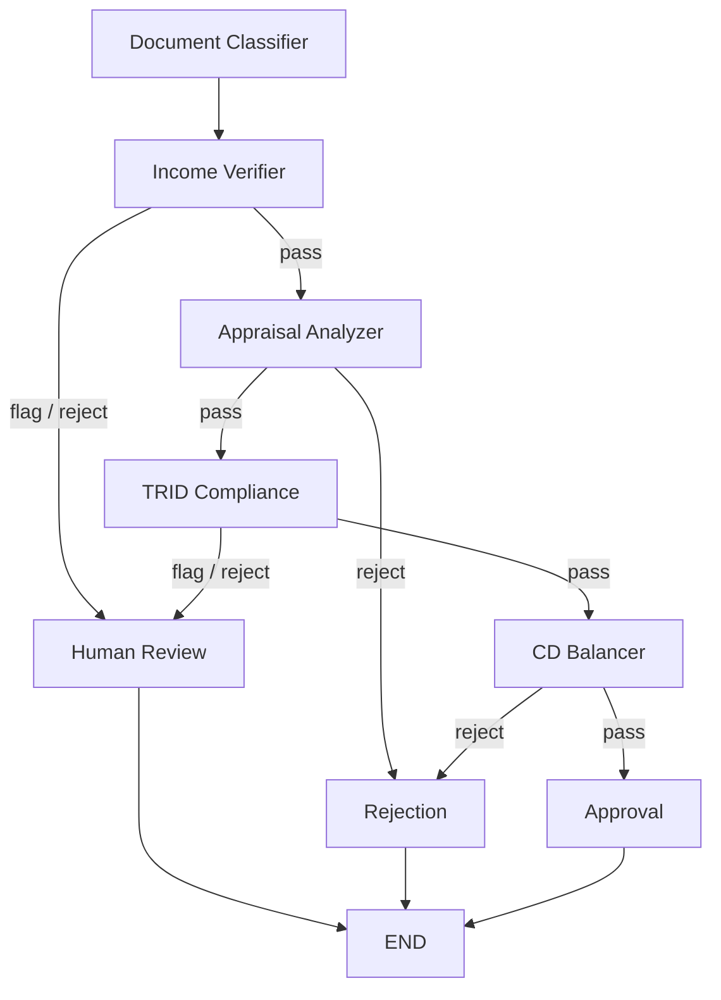

# AI Lending Pipeline

## Overview

Loan processing involves compliance checks, document verifications, and financial calculations that must happen in a precise sequence before a loan can close. A single missed step — an unverified income discrepancy, a TRID timeline violation, or a closing disclosure arithmetic error — can result in regulatory penalties, post-close defects, or investor buyback risk.

This project demonstrates a **LangGraph-powered multi-agent pipeline** that automates five key underwriting checks using deterministic, rule-based logic. Each agent is a focused specialist; the orchestrator handles routing and halting conditions. The same architecture applies across mortgage, auto, personal, and commercial lending workflows.

---

## Agent Graph



---

## Agents

| Agent | What It Checks | Key Rules | Output |
|---|---|---|---|
| `document_classifier` | Document types in the loan package | Reads `doc_type` field; falls back to filename pattern matching | `classified_docs` map |
| `income_verifier` | Income consistency across W2, paystub, tax return | >5% variance = FLAG; >15% = REJECT | `verified_income` in memory |
| `appraisal_analyzer` | LTV, appraisal gap, comparable sales | LTV >97% = REJECT; LTV >80% = FLAG (PMI); comp >20% off = FLAG | `ltv` in memory |
| `trid_compliance` | TRID timeline + fee tolerance buckets | CD ≥3 days before close; zero-tolerance fees cannot increase; 10% bucket max cumulative | `tolerance_results` in memory |
| `cd_balancer` | Closing Disclosure math balance | `cash_to_close = loan - down + costs - lender_credits - seller_credits`; discrepancy >$0.50 = REJECT | `balance_result` in memory |

---

## Sample Loans

| Loan | Scenario | Expected Result |
|---|---|---|
| `loan_001_clean.json` | All checks pass — W2/paystub/1040 agree, LTV 79%, TRID clean, CD balanced | **APPROVED** |
| `loan_002_income_mismatch.json` | W2 shows $85,000 vs stated $95,000 (10.5% variance — between 5% and 15% thresholds) | **REVIEW** |
| `loan_003_cd_imbalance.json` | CD line items sum correctly but stated cash-to-close is $127.50 off from computed | **REJECTED** |

---

## Quick Start

```bash
# 1. Clone / navigate to the project
cd ai-lending-pipeline

# 2. Install dependencies
pip install -r requirements.txt

# 3. Run the test suite
python -m pytest tests/ -v

# 4. Launch the Streamlit UI
streamlit run ui/app.py

# Or use the batch script (Windows)
run.bat
```

---

## Architecture

### Shared Memory (`core/memory.py`)

`PipelineMemory` is a dict-based store that agents use to share derived data without modifying state directly. For example, `income_verifier` writes `verified_income` and `appraisal_analyzer` writes `ltv`. Later agents (or the UI) can read these values without re-computing.

### Audit Trail (`core/audit.py`)

Every agent logs an entry to `AuditLogger` containing:
- Input summary
- Decision (pass / flag / reject)
- Confidence score
- Detailed findings list
- Metadata dict

The full audit trail is returned from `LoanPipeline.run()` and displayed in the UI.

### State (`core/state.py`)

`LoanState` is a `TypedDict` that flows through the LangGraph `StateGraph`. Each node receives the full state dict and returns an updated copy.

### Conditional Routing

LangGraph `add_conditional_edges` routes based on agent findings status:
- `income_verifier` flag/reject → `human_review`
- `appraisal_analyzer` reject → `rejection`
- `trid_compliance` flag/reject → `human_review`
- `cd_balancer` reject → `rejection`

---

## Extending with LLMs

Each agent's rule-based logic can be replaced with an LLM call — the graph routing remains identical. For example, `income_verifier.py` could use Claude to detect edge cases in self-employment income, while still returning the same `AgentFinding` TypedDict. No changes to the orchestrator are required.

```python
# Future: replace threshold math with LLM reasoning
response = anthropic_client.messages.create(
    model="claude-opus-4-7",
    messages=[{"role": "user", "content": f"Verify this income: {income_docs}"}],
)
```

---

## Project Structure

```
ai-lending-pipeline/
├── agents/           # Five specialist agent modules
├── core/             # State, memory, audit, orchestrator
├── models/           # Pydantic data models
├── mortgage_data/    # Sample loans and rule files
├── ui/               # Streamlit app
├── tests/            # Pytest test suite
└── requirements.txt
```
